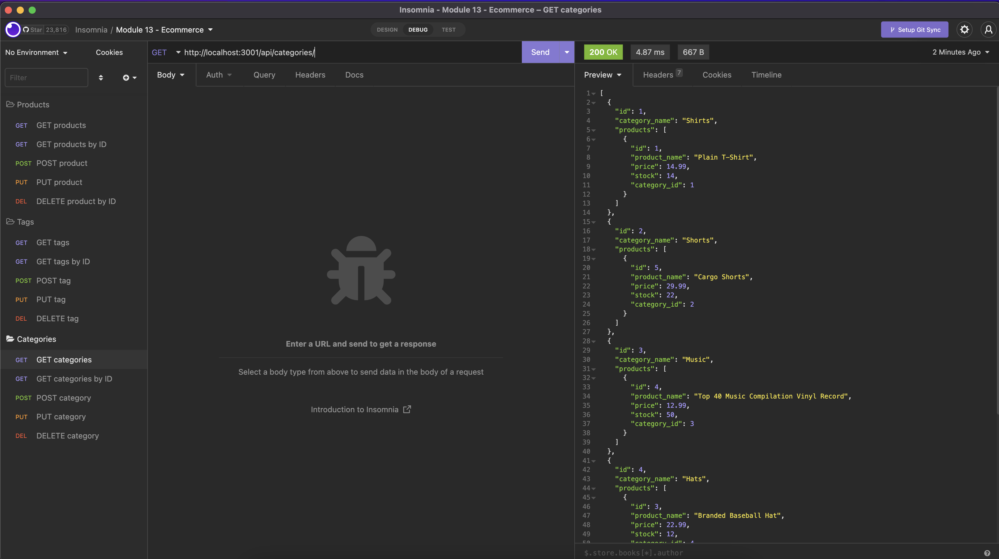

# module-13-ecommerce

## Overview

To compete with other e-commerce companies, I created a back end for my website.

In the back end I can view, create, update, and delete:

- Products
- Categories
- Tags

## Installation:

1. `git clone git@github.com:PDKetchum/module-13-ecommerce.git`
2. Open `server.js`

## How to use:

In terminal

1. Create `.env` file and enter mysql credentials with `DB_NAME` set as "`ecommerce_db`"
2. `npm install`
3. Connect to database with `mysql -u root -p`
4. `npm start`

GitHub URL: https://github.com/PDKetchum/module-13-ecommerce

Walk-through video: https://drive.google.com/file/d/1q81lrtHG6wh9-92sQWlUmVhjgTKMQSeM/view

_Screenshot of page_
